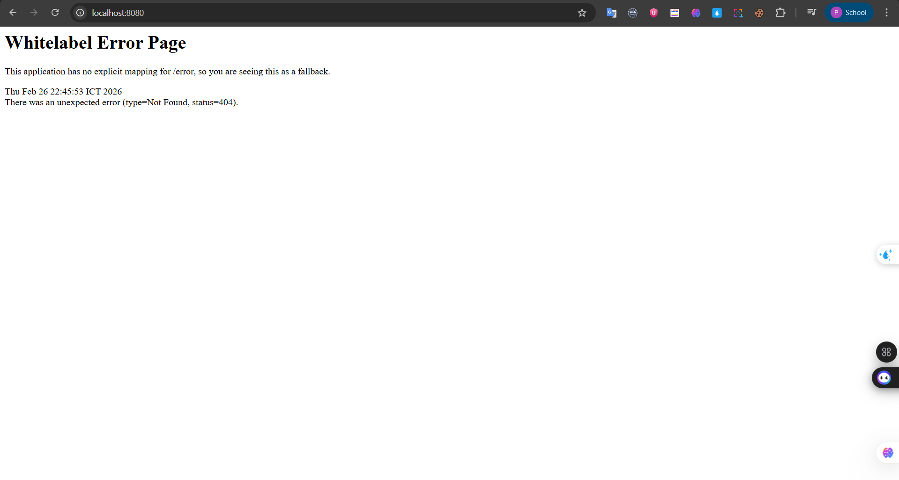

# Sửa lỗi: password authentication failed for user "postgres"

Backend báo **BUILD FAILURE** với `FATAL: password authentication failed for user "postgres"` nghĩa là mật khẩu kết nối PostgreSQL không đúng.

## Cách 1: Dùng file .env (khuyến nghị)

1. Vào thư mục backend: `D:\APP\cns-project\backend`
2. Tạo file tên **`.env`** (chấm env, không có đuôi .txt)
3. Ghi vào nội dung (sửa `MAT_KHAU_POSTGRES` thành mật khẩu thật bạn đặt khi cài PostgreSQL):

```
DB_URL=jdbc:postgresql://localhost:5432/cns_db
DB_USERNAME=postgres
DB_PASSWORD=MAT_KHAU_POSTGRES
```

4. Lưu file, chạy lại backend:

```powershell
.\mvnw.cmd spring-boot:run
```

## Cách 2: Đổi mật khẩu PostgreSQL thành CnsDev2026

Nếu muốn dùng mật khẩu mặc định **CnsDev2026** (không cần file .env):

1. Mở **Command Prompt** hoặc **PowerShell**.
2. Vào thư mục bin PostgreSQL (đổi 17 nếu bạn cài phiên bản khác):

```powershell
cd "C:\Program Files\PostgreSQL\17\bin"
```

3. Chạy (sẽ hỏi mật khẩu hiện tại của postgres, sau đó nhập mật khẩu mới **CnsDev2026**):

```powershell
.\psql -U postgres -c "ALTER USER postgres PASSWORD 'CnsDev2026';"
```

4. Không cần file `.env`, chạy lại backend: `.\mvnw.cmd spring-boot:run`

## Cách 3: Reset mật khẩu postgres khi không nhớ mật khẩu cũ

Khi chạy `psql -U postgres` báo **password authentication failed** nghĩa là mật khẩu bạn nhập sai (hoặc không nhớ). Làm theo các bước sau để đặt lại mật khẩu thành **CnsDev2026** (cần quyền Admin).

### Bước 1: Tạm tắt xác thực mật khẩu (trust)

1. Mở **Notepad (Run as Administrator)** hoặc VS Code với quyền Admin.
2. Mở file cấu hình (đổi `17` nếu bạn cài phiên bản khác):
   - **Đường dẫn:** `C:\Program Files\PostgreSQL\17\data\pg_hba.conf`
3. Tìm các dòng có dạng:
   ```
   # IPv4 local connections:
   host    all             all             127.0.0.1/32            scram-sha-256
   ```
   hoặc `md5` thay vì `scram-sha-256`.
4. Đổi **`scram-sha-256`** (hoặc **`md5`**) thành **`trust`** cho dòng đó:
   ```
   host    all             all             127.0.0.1/32            trust
   ```
5. Lưu file.

### Bước 2: Khởi động lại dịch vụ PostgreSQL

- Mở **services.msc** (Win + R → gõ `services.msc` → Enter).
- Tìm service **postgresql-x64-17** (hoặc tên tương tự).
- Chuột phải → **Restart**.

### Bước 3: Đổi mật khẩu postgres sang CnsDev2026

Mở **PowerShell** hoặc CMD (không cần Admin):

```powershell
cd "C:\Program Files\PostgreSQL\17\bin"
.\psql -U postgres -c "ALTER USER postgres PASSWORD 'CnsDev2026';"
```

Lần này **không hỏi mật khẩu** (vì đã dùng trust). Nếu thành công sẽ không báo lỗi.

### Bước 4: Bật lại xác thực mật khẩu

1. Mở lại file `C:\Program Files\PostgreSQL\17\data\pg_hba.conf` (Notepad/VS Code Admin).
2. Đổi **`trust`** về **`scram-sha-256`** (hoặc `md5` như cũ):
   ```
   host    all             all             127.0.0.1/32            scram-sha-256
   ```
3. Lưu file.
4. Vào **services.msc** → **Restart** service **postgresql-x64-17**.

### Bước 5: Chạy backend

```powershell
cd D:\APP\cns-project\backend
.\mvnw.cmd spring-boot:run
```

Không cần tạo file `.env` (backend dùng mặc định password **CnsDev2026**).

---

**Lưu ý:** Database **cns_db** phải đã được tạo (xem `docs/HUONG_DAN_POSTGRESQL.md`).
